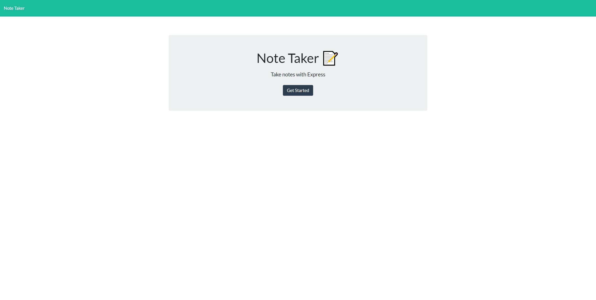
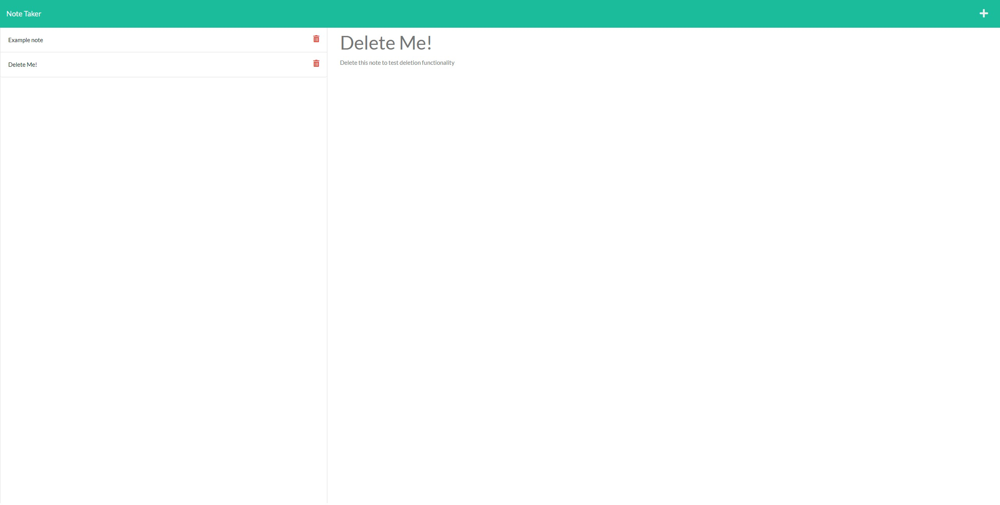

# Module 11 Note Taker Project

## Description

This is Adrian Jimenez's module 11 Note Taker challenge submission. 

I started this project off by first defining all the routes necessary for the app to be able to navigate across its pages, and manage the notes within db.json. Once that functionality was complete, I added a lib folder containing functions for manipulating the notes in db.json. These functions were then accessed by the respective api routes in my apiRoutes folder. After completing this, my app was almost functional, with the exception of a few bugs I had to fix. Once I felt the project was complete, I deployed it to heroku.

## Table of Contents

- [Installation](#installation)
- [Languages](#languages)
- [Usage](#usage)
- [Credits](#credits)
- [License](#license)
- [Contributing](#contributing)
- [Questions](#questions)

## Installation

In order to install this project, download all files and have node.js installed on your machine. Navigate to the directory in which server.js is stored in and type: 

    npm install

Once all dependencies have been downloaded, you can excecute server.js by typing node server.js.

## Languages

* HTML
* CSS
* JavaScript
* Node.js
* Express.js
* npm uuid package
* Heroku

## Usage

> URL: https://note-taker-aj.herokuapp.com/

In order to use this project, navigate to the deployed heroku url or invoke it in the command line. Once you have navigated to the page's URL, you can start adding notes by clicking "Get Started". Once on this page, you may add notes with the plus icon on the top right corner, delete notes by clicking on the trash can icon, or edit notes by clicking on already existing notes. Remember to save your notes with the save icon that appears next to the plus icon.

## Credits

* Adrian Jimenez

## License

This project is licensed under the MIT License. See [LICENSE.md](./LICENSE.md) for more details.

---

## Contributing

This project follows the contributor covenant contribution guidelines. See [here](https://www.contributor-covenant.org/version/2/1/code_of_conduct/) 

## Questions

If you have any questions or concerns visit my [github](https://github.com/PuppetAJ) or send me an email at <adrianjimenez1950@gmail.com>. 

